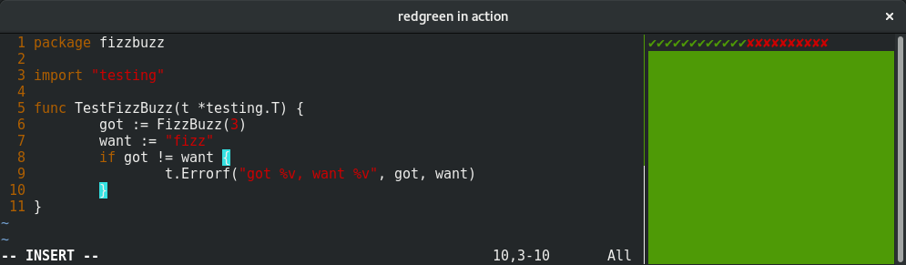

[redgreen](https://github.com/rhcarvalho/redgreen) is your companion during
[TDD](https://en.wikipedia.org/wiki/Test-driven_development) sessions.

This tool provides instantaneous feedback about the current state of a test
suite, automatically triggered whenever a file changes. It shows a green or red
bar and a history of the previous test runs, useful for keeping track of clean
refactors from green to green.
