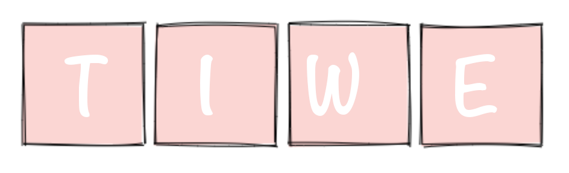

An early-stage distributed game, [Tiwe](https://github.com/rhcarvalho/tiwe) is
an experiment that touches distributed systems, consensus algorithms,
cryptography, protocol design, and even blockchain.

Progressing slowly and bringing opportunities to read and learn more about
interesting, often unexpected, topics.
